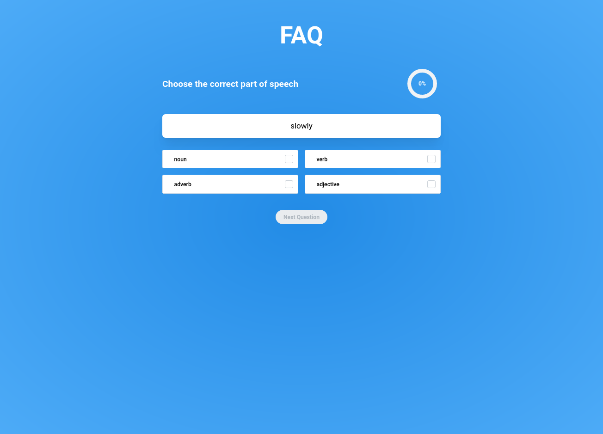
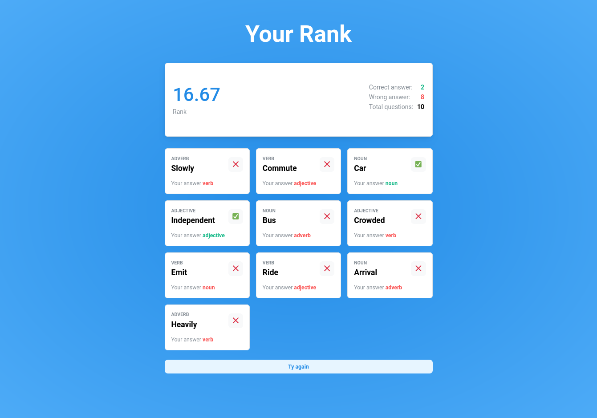
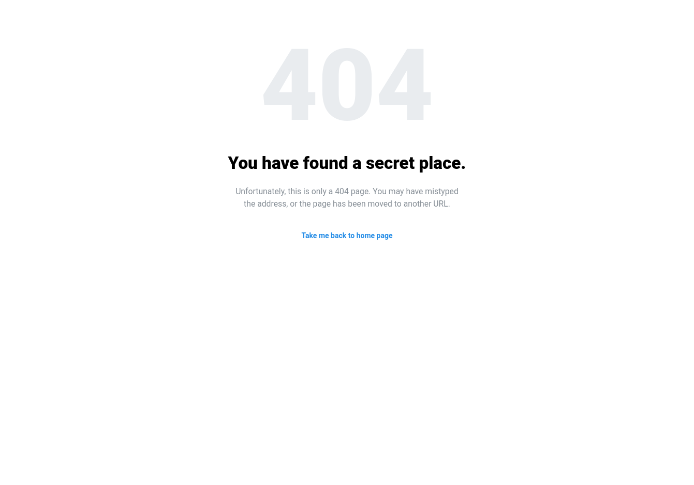

# JavaScript developer task

## Task description

In English language, words can be categorized according to their syntactic functions, which is known as "Part of Speech".
Examples of part of speech: (noun, verb, adjective, ...)

Check this [link](https://en.wikipedia.org/wiki/Part_of_speech) for more information.

Your task is to make an interactive activity using React.js, node.js, and Express.js that helps the students practice categorizing a set of words according to their part of speech.

Feel free to make the design that you feel proper for such activity as long as it **follows the below requirements**.

**Testing Data**: No need to create a database, you can use the data provided in the attached JSON file (TestData.json).

### The Express App (server side) should

- **words endpoint** : provides an endpoint that returns a list of 10 objects selected randomly from the "wordsList" (check wordsList in TestData.json). The array should include at least 1 adjective, 1 adverb, 1 noun, and 1 verb.
- **rank endpoint**: provides an endpoint that takes the final score in the request body, and responds back with the rank% rounded to the nearest hundredth. The rank represents the percentage of scores (check scoresList in TestData.json) below the given final score.

**Score => Rank use cases:**

```txt
- Score: 90 => Rank: 80
```

**\*explanation**: There are 24 scores out of 30 in the scoresList which are below 90. This is 80% of the scoresList, so the rank will be 80%. (check scoresList in TestData.json)

```txt
- Score: 60 => Rank: 56.67
- Score: 50 => Rank: 40
- Score: 30 => Rank: 26.67
```

### The React App (client side) should include

#### Practice Screen

- Fetch the words list from "words" endpoint.
- Shows the student one word each time and below the word there are four buttons respresenting for options of part of speech (noun, adverb, adjective, or verb)
- After an option got selected, the student should get a feedback whether his/her answer was correct or incorrect. However, it shouldn't show the correct answer in case an incorrect answer got selected.
  Has a progress bar that shows the student his/her progress in %
  - Progress is calculated as follows: (number of answered questions / total number of questions)\*100

#### Rank Screen

- Displayed after the user answers the final question
- Send a POST request to "rank" endpoint to get the student's rank based on his/her score % provided in the request body.
  - Score is calculated as follows: (number of correct answers / total number of questions)\*100
- Shows the student his/her rank across his/her peers (not his/her score) when he/she reaches progress of 100% (finishes the activity).
- Has a "Try Again" button that enables the student to repeat the activity again.

### Task Submission

- You have to publish the solution to a public repository on GitHub and share the link with us.
- The repository should have two folders, one for the server side app and one for the client side app.
- A detailed **README.md** file should be included in the repository. It should explain how to run, use, and test the app.

## Quick start 🚀

### First Step

Download the files from [`Repo`](https://github.com/Mohammed-Taysser/nagwa-task) or clone it with **git** version control:

```shell
git clone https://github.com/Mohammed-Taysser/nagwa-task.git
```

### Second Step

in nagwa-task directory there are two folder

- server (Nodejs + Express.js)
- client (React.js)

#### client Directory

to get to client Directory

```shell
cd client
```

Inside client Directory Install Dependencies By

```shell
npm install
# OR
yarn
```

Start The Development Server

```shell
npm start
# OR
yarn start
```

#### Server Directory

to get to server Directory

```shell
cd server
```

Inside server Directory Install Dependencies By

```shell
npm install
# OR
yarn
```

Start The Development Server

```shell
npm start:dev
# OR
yarn start:dev
```

## Server

### Available routes

| Method | Route         | Returned Value | Info                                                             |
| ------ | ------------- | -------------- | ---------------------------------------------------------------- |
| `GET`  | `/`           | `Boolean`      | get server health check                                          |
| `GET`  | `/word`       | `Word[]`       | get 10 random words                                              |
| `GET`  | `/rank/score` | `number`       | get rank by passing score as parameter like `/rank/90`           |
| `GET`  | `/rank`       | `number`       | get rank by passing score as query like `/rank?score=90`         |
| `POST` | `/rank`       | `number`       | get rank by passing score as body params `/rank`, `{"score":90}` |

### Available scripts

| script      | info                                     |
| ----------- | ---------------------------------------- |
| `start:dev` | start the server in development          |
| `start`     | build and start the server in production |
| `build`     | build the project                        |

### REFACTORED_WORD_DB

Let's talk about `REFACTORED_WORD_DB`, it's an object of word type (like none, verb and so on) represented as key for each type has an array of words for that type. if look unclear see the following result:

```json
{
  "adverb": [
    { "id": 1, "word": "slowly", "pos": "adverb" },
    { "id": 15, "word": "heavily", "pos": "adverb" }
  ],
  "verb": [
    { "id": 2, "word": "ride", "pos": "verb" },
    { "id": 4, "word": "commute", "pos": "verb" },
    { "id": 6, "word": "walk", "pos": "verb" },
    { "id": 11, "word": "emit", "pos": "verb" }
  ],
  "noun": [
    { "id": 3, "word": "bus", "pos": "noun" },
    { "id": 5, "word": "emissions", "pos": "noun" },
    { "id": 8, "word": "car", "pos": "noun" },
    { "id": 10, "word": "arrival", "pos": "noun" },
    { "id": 14, "word": "lane", "pos": "noun" }
  ],
  "adjective": [
    { "id": 7, "word": "fast", "pos": "adjective" },
    { "id": 9, "word": "crowded", "pos": "adjective" },
    { "id": 12, "word": "independent", "pos": "adjective" },
    { "id": 13, "word": "convenient", "pos": "adjective" }
  ]
}
```

### Utils

#### statusCode

An object of success and error each of them has the popular status code like 200 for success request, 404 for not found resources and so on.

#### Random

a class of utils use for random process like random item of array or random number and more (for now has single method call arrayItem )

##### arrayItem

return random item of array, use the `Math.random()` method to generate a random index between 0 and the length of the array, and then return the item at that index

```js
const myArray = [1, 2, 3, 4, 5, 6, 7, 8, 9, 10];
const randomItem = Random.arrayItem(myArray);
console.log(randomItem);
```

## Client

### Pages

#### Practice



#### Rank



#### 404



## TODO

- [x] use TypeScript
- [x] add any extra feature(s) that you think might improve such activity
- [x] Code readability is a must. Write comments to explain your code.
- [x] Follow a clean code structure.
- [x] Must apply code reuse. Never write the same code twice (DRY clean code concept).

## Limitation

### Server

- Sending request to `/rank` without score will give an error as response.

### Client

- Rank page: not showing rank without complete the survey, it show an error that the survey not complete
- Practice page: can't skip the question
